# 第三课


## 基础作业 

### A. 在[茴香豆 Web 版](https://openxlab.org.cn/apps/detail/tpoisonooo/huixiangdou-web)中创建知识问答助手

#### 助手创建


#### 文档上传（目前无法删除修改已上传文档）

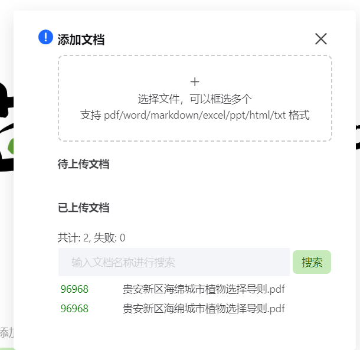

#### 添加正反例

- 参考[经验贴](https://zhuanlan.zhihu.com/p/691827925)使用kimi网站生成正反例
- [历史会话](https://kimi.moonshot.cn/share/codndaeaoforv6u1rolg)
- 
- 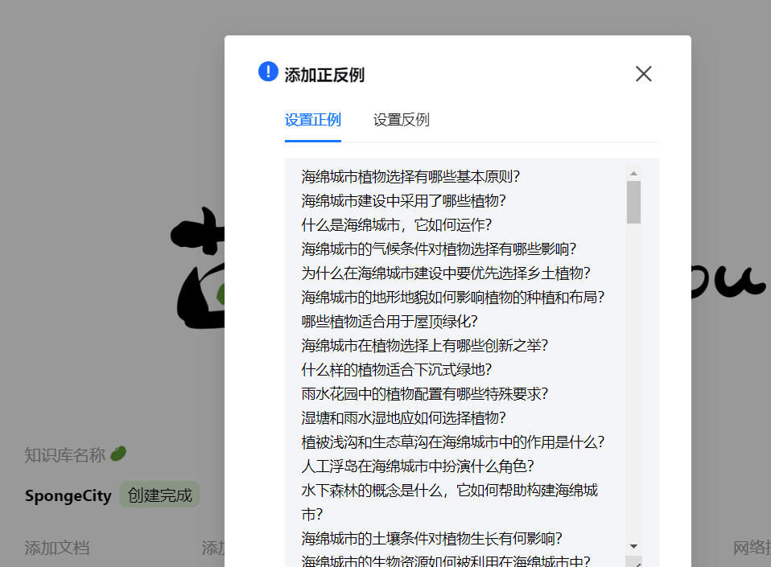

#### 开启网络搜索功能

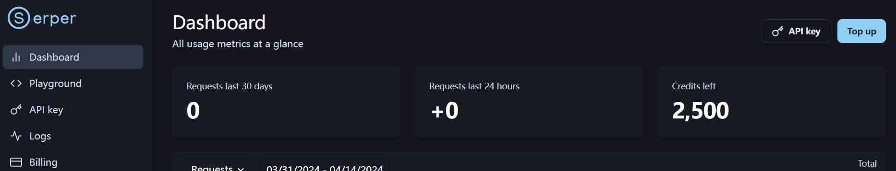

#### 交互测试（茴香豆web版本）

- web问答助手已接入飞书群聊，详细步骤参考进阶作业【应用方向A】，测试在两个版本中同时进行，以飞书群消息为主要参考结果。

- 第一轮（使用普通问题提问，未生成准确回答）

  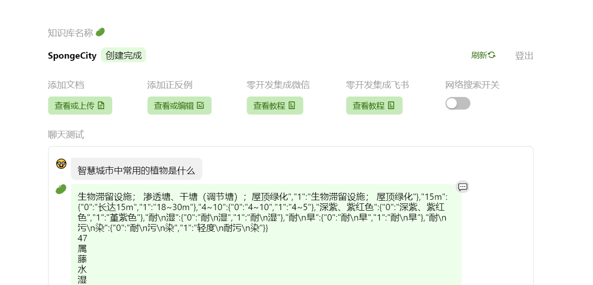

- 第二轮（使用反例问题提问，茴香豆给出了答复）

  如图，此处打开了网络搜索功能

  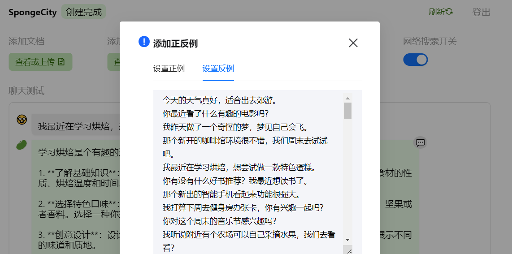

- 第三轮（使用正例提问，效果正常）

  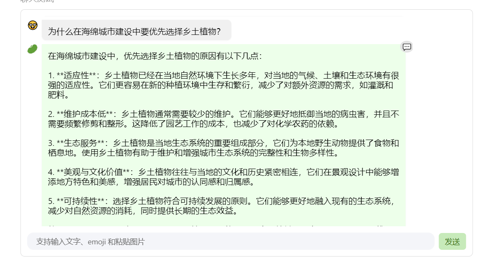

- 第四轮（使用正例提问，但没有响应）

  

- 第五轮（web版本与飞书群消息回复效果正常，但回复模板明显不统一，后续优化可参考第三轮的生成效果）


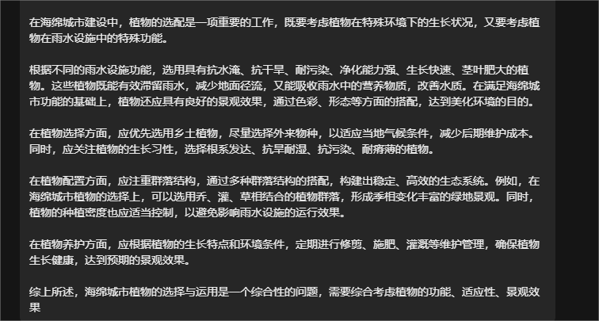


### B. 参考 [代码](https://github.com/InternLM/HuixiangDou/tree/main/web) 在自己的服务器部署茴香豆 Web 版（待更新）

#### 


### C. 在 [Intern Studio](https://studio.intern-ai.org.cn/) 服务器端部署茴香豆**

#### **配置环境**

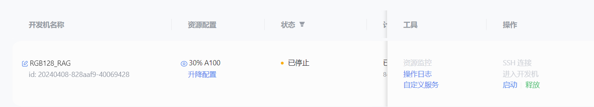

- 复制运行 InternLM 的基础环境命名为 `InternLM2_Huixiangdou`

```
studio-conda -o internlm-base -t InternLM2_Huixiangdou
```


- 运行 ***conda*** 命令，激活 `InternLM2_Huixiangdou` ***python*** 虚拟环境:

```
conda activate InternLM2_Huixiangdou
```

- 环境激活后，命令行左边会显示当前 InternLM2_Huixiangdou 的环境名称


#### **下载基础文件**

教程选用 **InternLM2-Chat-7B** 作为基础模型

```
# 创建模型文件夹
cd /root && mkdir models

# 复制BCE模型
ln -s /root/share/new_models/maidalun1020/bce-embedding-base_v1 /root/models/bce-embedding-base_v1
ln -s /root/share/new_models/maidalun1020/bce-reranker-base_v1 /root/models/bce-reranker-base_v1

# 复制大模型参数（下面的模型，根据作业进度和任务进行**选择一个**就行）
ln -s /root/share/new_models/Shanghai_AI_Laboratory/internlm2-chat-7b /root/models/internlm2-chat-7b
```

(1).png)

#### **下载安装茴香豆**

- 安装茴香豆运行所需依赖。

```
# 安装 python 依赖
# pip install -r requirements.txt

pip install protobuf==4.25.3 accelerate==0.28.0 aiohttp==3.9.3 auto-gptq==0.7.1 bcembedding==0.1.3 beautifulsoup4==4.8.2 einops==0.7.0 faiss-gpu==1.7.2 langchain==0.1.14 loguru==0.7.2 lxml_html_clean==0.1.0 openai==1.16.1 openpyxl==3.1.2 pandas==2.2.1 pydantic==2.6.4 pymupdf==1.24.1 python-docx==1.1.0 pytoml==0.1.21 readability-lxml==0.8.1 redis==5.0.3 requests==2.31.0 scikit-learn==1.4.1.post1 sentence_transformers==2.2.2 textract==1.6.5 tiktoken==0.6.0 transformers==4.39.3 transformers_stream_generator==0.0.5 unstructured==0.11.2

## 因为 Intern Studio 不支持对系统文件的永久修改，在 Intern Studio 安装部署的同学不建议安装 Word 依赖，后续的操作和作业不会涉及 Word 解析。
## 想要自己尝试解析 Word 文件的同学，uncomment 掉下面这行，安装解析 .doc .docx 必需的依赖
# apt update && apt -y install python-dev python libxml2-dev libxslt1-dev antiword unrtf poppler-utils pstotext tesseract-ocr flac ffmpeg lame libmad0 libsox-fmt-mp3 sox libjpeg-dev swig libpulse-dev
```

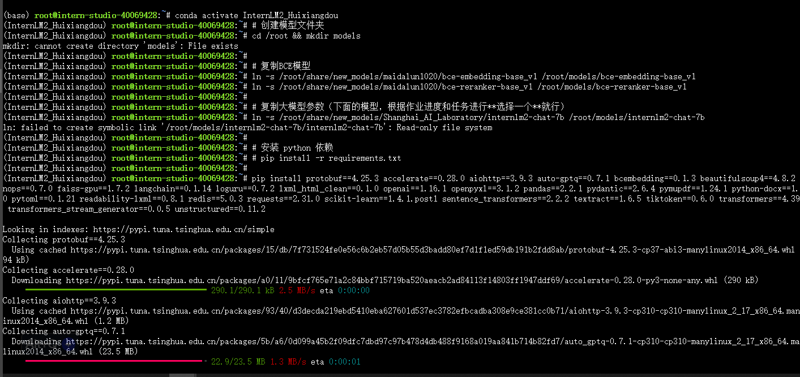

- 从茴香豆官方仓库下载茴香豆。

```
cd /root
# 下载 repo
git clone https://github.com/internlm/huixiangdou && cd huixiangdou
git checkout 447c6f7e68a1657fce1c4f7c740ea1700bde0440
```

- 署在自己的服务器上（待更新）


#### 使用茴香豆搭建 RAG 助手

##### 修改配置文件

用已下载模型的路径替换 `/root/huixiangdou/config.ini` 文件中的默认模型，需要修改 3 处模型地址，分别是:

命令行输入下面的命令，修改用于向量数据库和词嵌入的模型

```
sed -i '6s#.*#embedding_model_path = "/root/models/bce-embedding-base_v1"#' /root/huixiangdou/config.ini
```

用于检索的重排序模型

```
sed -i '7s#.*#reranker_model_path = "/root/models/bce-reranker-base_v1"#' /root/huixiangdou/config.ini
```

和本次选用的大模型

```
sed -i '29s#.*#local_llm_path = "/root/models/internlm2-chat-7b"#' /root/huixiangdou/config.ini
```

修改好的配置文件应该如下图所示：

[](https://github.com/InternLM/Tutorial/blob/camp2/huixiangdou/imgs/model_path.png)


##### 创建知识库


本示例中，使用 **InternLM** 的 **Huixiangdou** 文档作为新增知识数据检索来源，在不重新训练的情况下，打造一个 **Huixiangdou** 技术问答助手。

首先，下载 **Huixiangdou** 语料：

```
cd /root/huixiangdou && mkdir repodir

git clone https://github.com/internlm/huixiangdou --depth=1 repodir/huixiangdou
```


提取知识库特征，创建向量数据库。数据库向量化的过程应用到了 **LangChain** 的相关模块，默认嵌入和重排序模型调用的网易 **BCE 双语模型**，如果没有在 `config.ini` 文件中指定本地模型路径，茴香豆将自动从 **HuggingFace** 拉取默认模型。

除了语料知识的向量数据库，茴香豆建立接受和拒答两个向量数据库，用来在检索的过程中更加精确的判断提问的相关性，这两个数据库的来源分别是：

- 接受问题列表，希望茴香豆助手回答的示例问题
  - 存储在 `huixiangdou/resource/good_questions.json` 中
- 拒绝问题列表，希望茴香豆助手拒答的示例问题
  - 存储在 `huixiangdou/resource/bad_questions.json` 中
  - 其中多为技术无关的主题或闲聊
  - 如："nihui 是谁", "具体在哪些位置进行修改？", "你是谁？", "1+1"

运行下面的命令，增加茴香豆相关的问题到接受问题示例中：

```
cd /root/huixiangdou
mv resource/good_questions.json resource/good_questions_bk.json

echo '[
    "mmpose中怎么调用mmyolo接口",
    "mmpose实现姿态估计后怎么实现行为识别",
    "mmpose执行提取关键点命令不是分为两步吗，一步是目标检测，另一步是关键点提取，我现在目标检测这部分的代码是demo/topdown_demo_with_mmdet.py demo/mmdetection_cfg/faster_rcnn_r50_fpn_coco.py checkpoints/faster_rcnn_r50_fpn_1x_coco_20200130-047c8118.pth   现在我想把这个mmdet的checkpoints换位yolo的，那么应该怎么操作",
    "在mmdetection中，如何同时加载两个数据集，两个dataloader",
    "如何将mmdetection2.28.2的retinanet配置文件改为单尺度的呢？",
    "1.MMPose_Tutorial.ipynb、inferencer_demo.py、image_demo.py、bottomup_demo.py、body3d_pose_lifter_demo.py这几个文件和topdown_demo_with_mmdet.py的区别是什么，\n2.我如果要使用mmdet是不是就只能使用topdown_demo_with_mmdet.py文件，",
    "mmpose 测试 map 一直是 0 怎么办？",
    "如何使用mmpose检测人体关键点？",
    "我使用的数据集是labelme标注的，我想知道mmpose的数据集都是什么样式的，全都是单目标的数据集标注，还是里边也有多目标然后进行标注",
    "如何生成openmmpose的c++推理脚本",
    "mmpose",
    "mmpose的目标检测阶段调用的模型，一定要是demo文件夹下的文件吗，有没有其他路径下的文件",
    "mmpose可以实现行为识别吗，如果要实现的话应该怎么做",
    "我在mmyolo的v0.6.0 (15/8/2023)更新日志里看到了他新增了支持基于 MMPose 的 YOLOX-Pose，我现在是不是只需要在mmpose/project/yolox-Pose内做出一些设置就可以，换掉demo/mmdetection_cfg/faster_rcnn_r50_fpn_coco.py 改用mmyolo来进行目标检测了",
    "mac m1从源码安装的mmpose是x86_64的",
    "想请教一下mmpose有没有提供可以读取外接摄像头，做3d姿态并达到实时的项目呀？",
    "huixiangdou 是什么？",
    "使用科研仪器需要注意什么？",
    "huixiangdou 是什么？",
    "茴香豆 是什么？",
    "茴香豆 能部署到微信吗？",
    "茴香豆 怎么应用到飞书",
    "茴香豆 能部署到微信群吗？",
    "茴香豆 怎么应用到飞书群",
    "huixiangdou 能部署到微信吗？",
    "huixiangdou 怎么应用到飞书",
    "huixiangdou 能部署到微信群吗？",
    "huixiangdou 怎么应用到飞书群",
    "huixiangdou",
    "茴香豆",
    "茴香豆 有哪些应用场景",
    "huixiangdou 有什么用",
    "huixiangdou 的优势有哪些？",
    "茴香豆 已经应用的场景",
    "huixiangdou 已经应用的场景",
    "huixiangdou 怎么安装",
    "茴香豆 怎么安装",
    "茴香豆 最新版本是什么",
    "茴香豆 支持哪些大模型",
    "茴香豆 支持哪些通讯软件",
    "config.ini 文件怎么配置",
    "remote_llm_model 可以填哪些模型?"
]' > /root/huixiangdou/resource/good_questions.json
```

再创建一个测试用的问询列表，用来测试拒答流程是否起效：

```
cd /root/huixiangdou

echo '[
"huixiangdou 是什么？",
"你好，介绍下自己"
]' > ./test_queries.json
```

在确定好语料来源后，运行下面的命令，创建 RAG 检索过程中使用的向量数据库：

```
# 创建向量数据库存储目录
cd /root/huixiangdou && mkdir workdir 

# 分别向量化知识语料、接受问题和拒绝问题中后保存到 workdir
python3 -m huixiangdou.service.feature_store --sample ./test_queries.json
```


#####  运行茴香豆知识助手

- 测试向量数据库效果

```
# 填入问题
sed -i '74s/.*/    queries = ["huixiangdou 是什么？", "茴香豆怎么部署到微信群", "今天天气怎么样？"]/' /root/huixiangdou/huixiangdou/main.py

# 运行茴香豆
cd /root/huixiangdou/
python3 -m huixiangdou.main --standalone
```


- `InternLM2-Chat-7B` 的关于 `huixiangdou` 问题的原始输出：

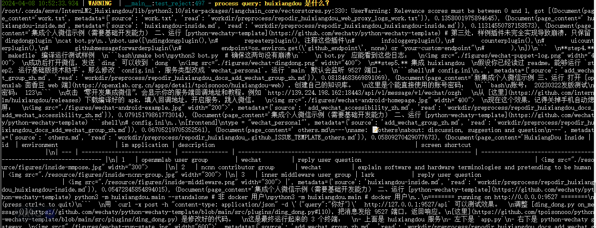

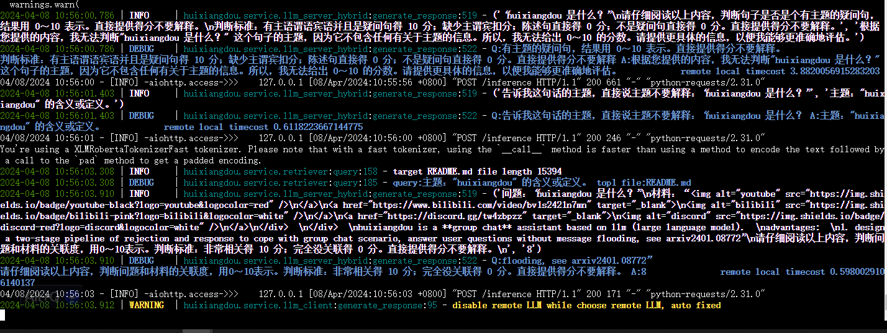


- 提问“茴香豆怎样部署到微信群？”

  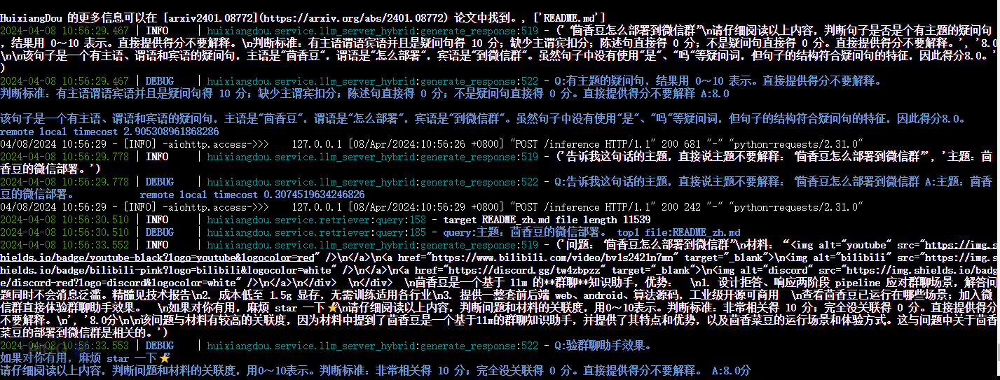

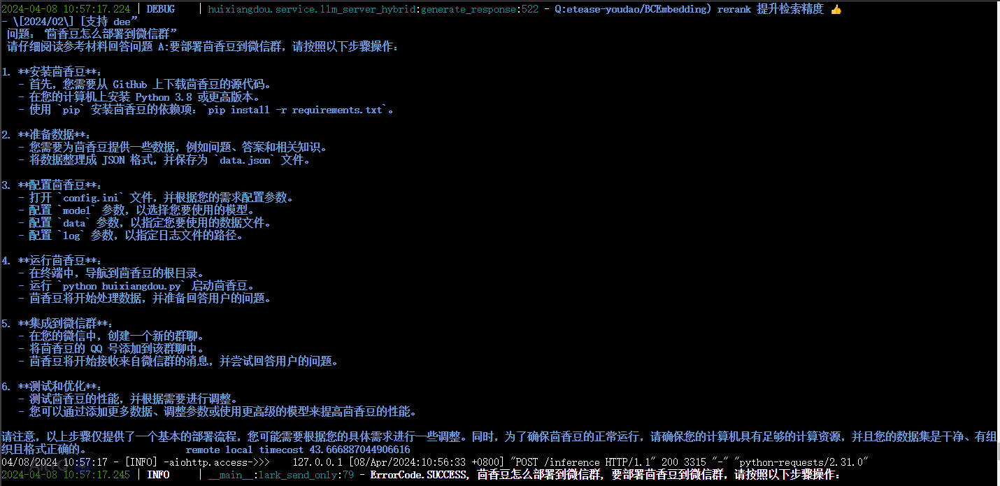


## 进阶作业 

### A.【应用方向】 结合自己擅长的领域知识（游戏、法律、电子等）、专业背景，搭建个人工作助手或者垂直领域问答助手，参考茴香豆官方文档，部署到下列任一平台。

#### 飞书

参考[**茴香豆零编程接入飞书**](https://aicarrier.feishu.cn/docx/H1AddcFCioR1DaxJklWcLxTDnEc )教程，进入[飞书开放平台](https://open.feishu.cn/app?lang=zh-CN)进行配置

1. 创建企业自建应用
2. 添加机器人，作为群聊bot
3. 飞书App ID和App Secret  ----- > Integrate With Lark 表单
4. Integrate With Lark 中提供的加密策略 ------> 飞书开发配置-事件与回调tab下的加密策略
5. Integrate With Lark 中提供的事件请求地址 ------ > 飞书开发配置-事件与回调tab下的事件配置

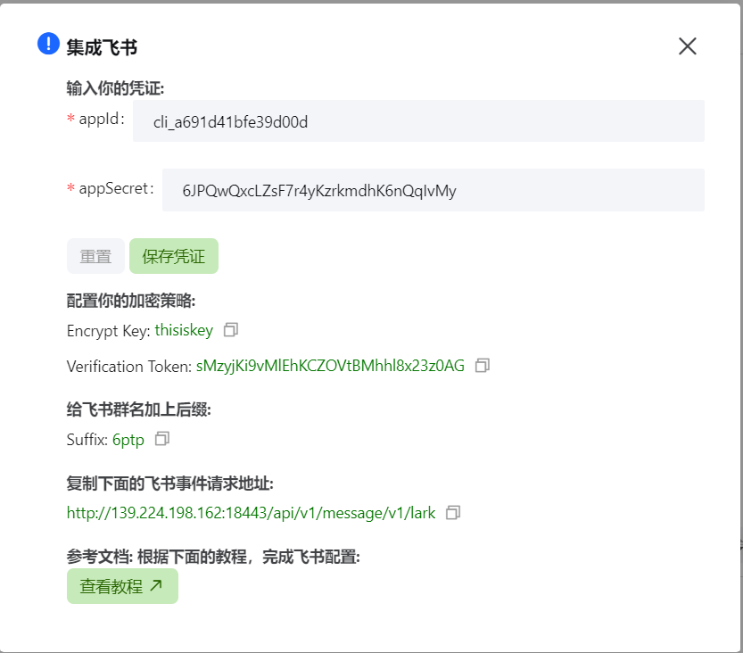

6. 权限配置：继续点击当前页面的【添加事件】按钮，搜索【接收消息】事件，并申请开通对应权限

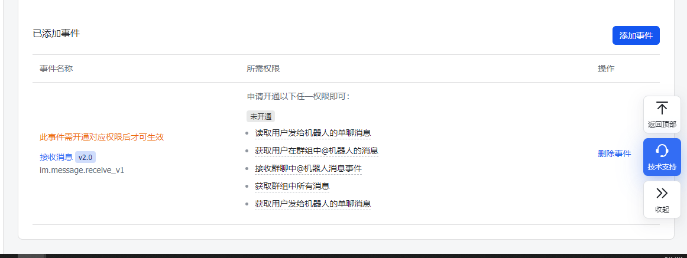

7. 权限配置：点击开发配置-权限管理tab下，申请开通3个权限

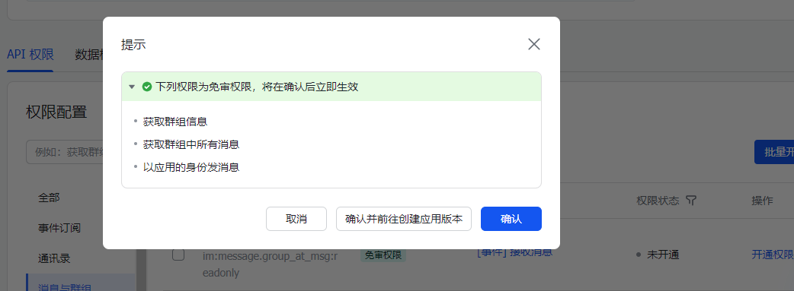

8. 点击上方提示栏，发布当前应用版本，提示“已发布”后即配置成功。

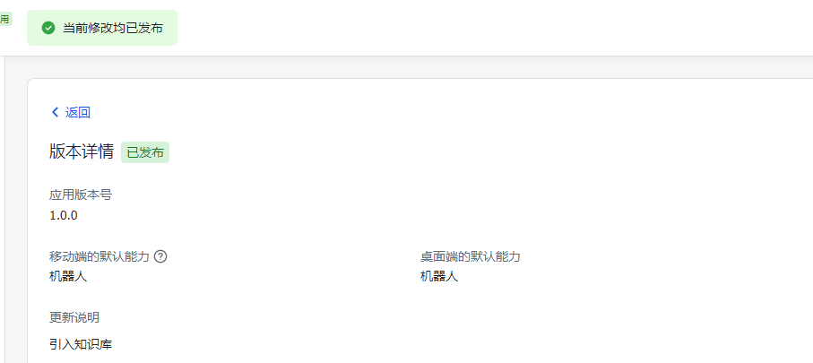

9. 将刚刚创建并发布的应用机器人添加到群聊中，参考[在群组中使用机器人](https://www.feishu.cn/hc/zh-CN/articles/360024984973-在群组中使用机器人)

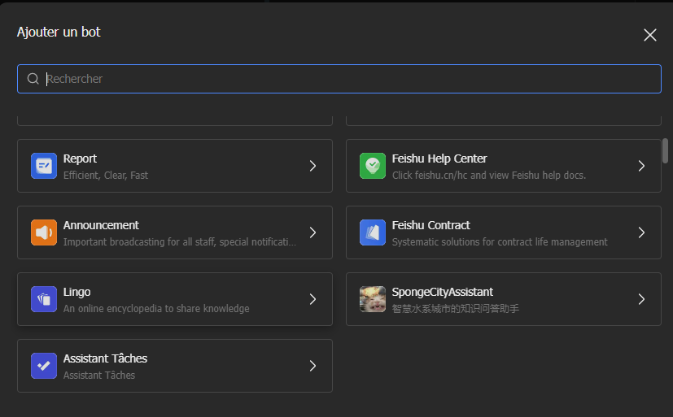

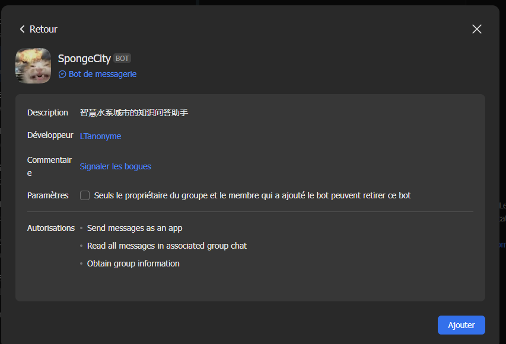

10. Integrate With Lark 中提供的suffix字符串 ------- > 飞书群名称后直接添加该suffix。


11. 交互测试

- 第一轮（使用普通问题提问，两者都未生成准确回答）

  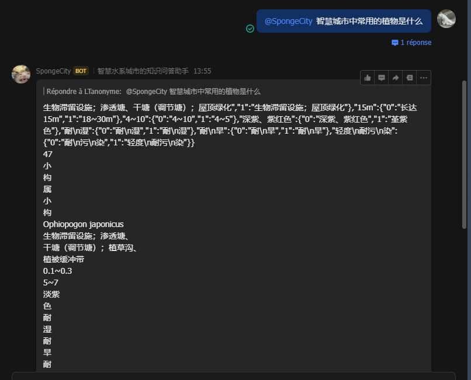

- 第二轮（使用反例问题提问，飞书群bot未响应，效果正常）

  

- 第三轮（使用正例提问，效果正常）

  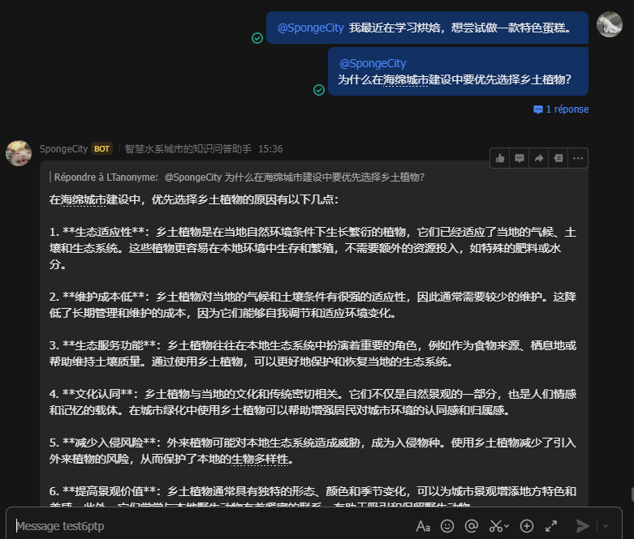

- 第四轮（使用正例提问，但两者都没有响应）

  

  

- 第五轮（效果正常，但回复模板明显不统一，后续优化可参考第三轮的生成效果）


#### 微信（未完成）

#### 可以使用 茴香豆 Web 版 或 InternLM Studio 云端服务器部署（待更新）


### B.【算法方向】尝试修改 `good_questions.json`、调试 prompt 或应用其他 NLP 技术，如其他 chunk 方法，提高个人工作助手的表现。（待更新）

- 完成不少于 400 字的笔记 ，记录自己的尝试和调试思路，涵盖全过程和改进效果截图


## 大作业项目选题（待更新）


### A.【工程方向】 参与贡献茴香豆前端，将茴香豆助手部署到下列平台

- Github issue、Discord、钉钉、X

### B.【应用方向】 茴香豆RAG-Agent

- 应用茴香豆建立一个 ROS2 的机器人Agent

### C.【算法方向】 茴香豆多模态

- 参与茴香豆多模态的工作
